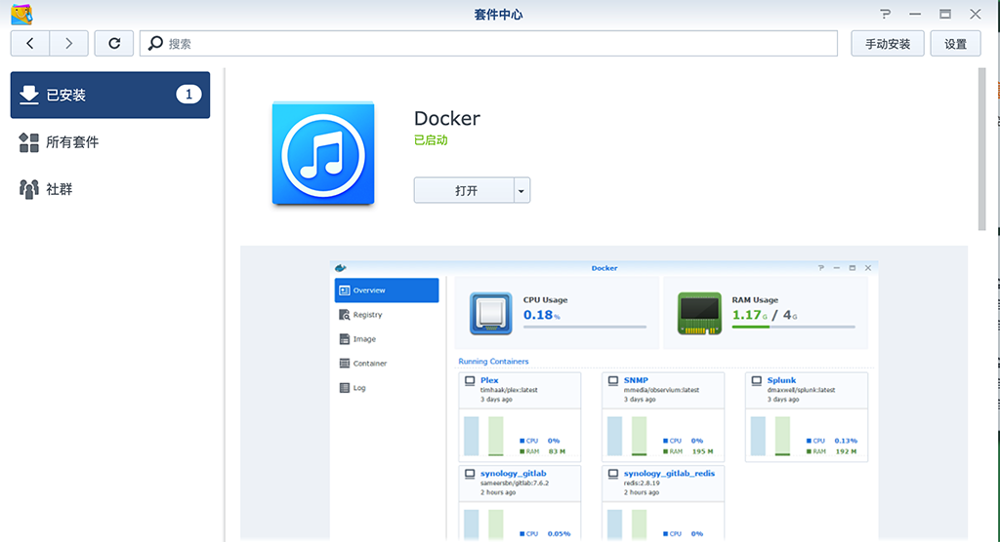
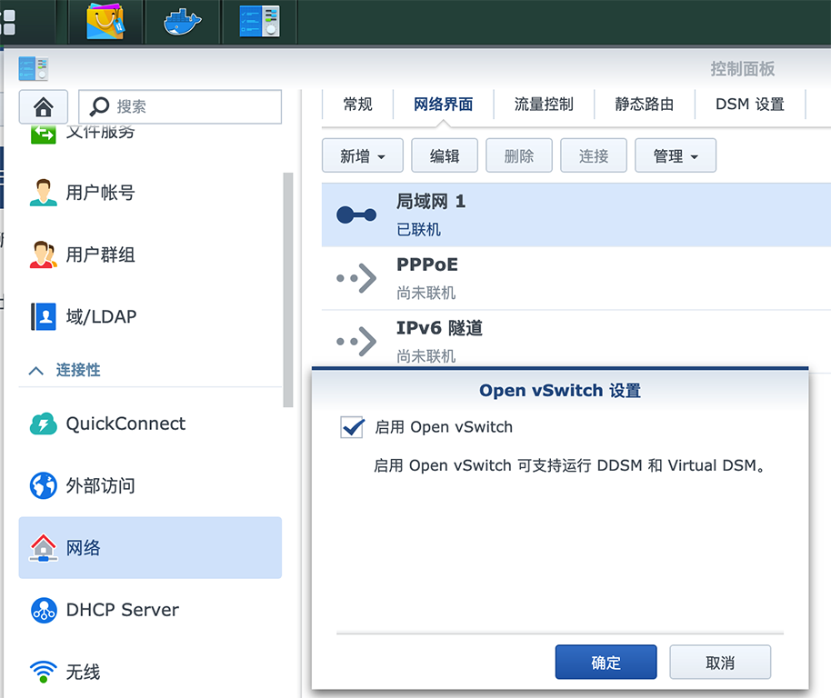
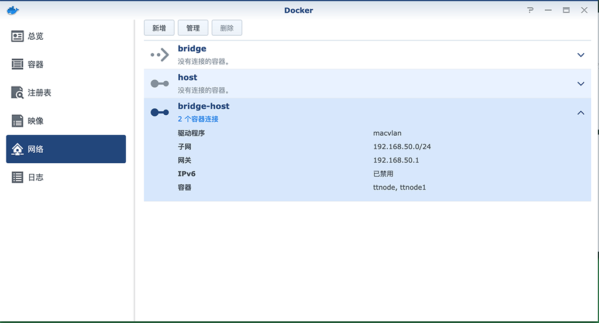
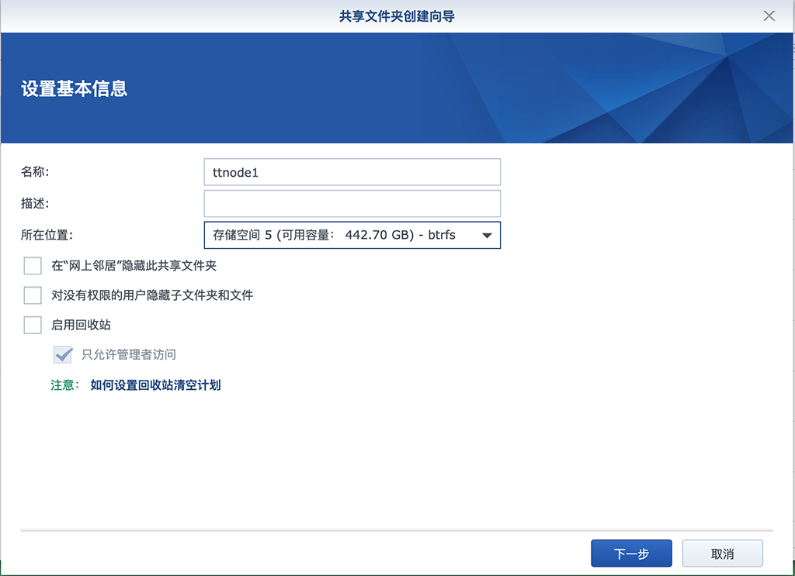
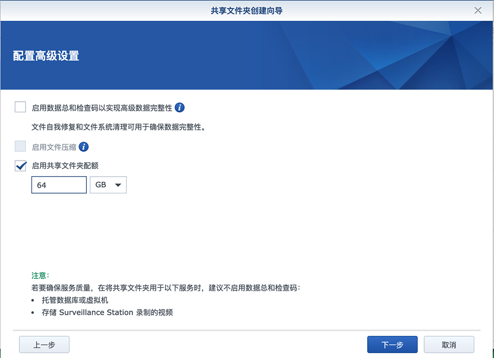
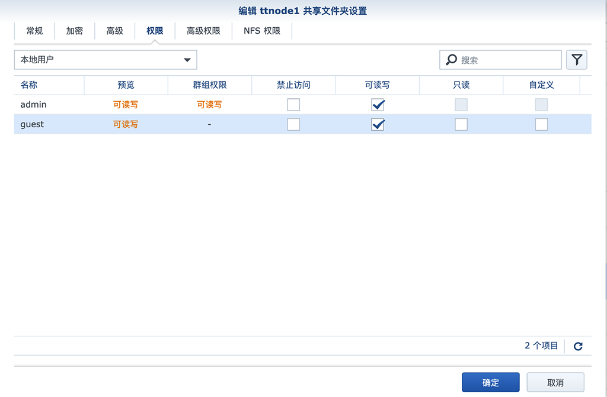
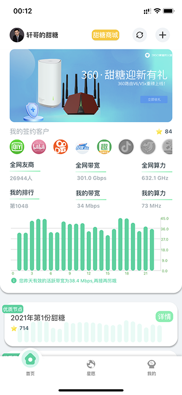
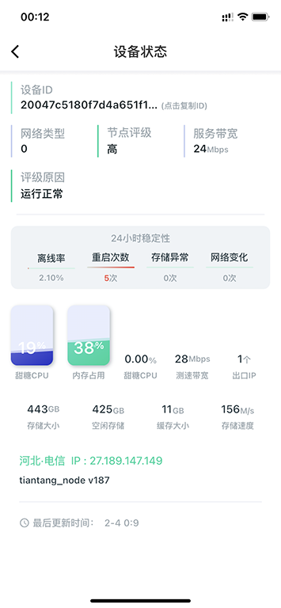

# 群晖玩转甜糖星愿攻略

玩群晖或者nas的同学，有很大一部分原因是nas低功耗省电，即使24小时全开，一天也最多消耗1度电不到，特别适合挂PT。但即使这么省电，一个月下来还是会有将近30度的电费产生。

有了甜糖星愿后，这个问题轻松解决，这里我们充分应用群晖的docker功能多开甜糖星愿，每天的收益足够抵消每天的耗电费用，且绰绰有余，是不是很不错。如果你也有兴趣，赶紧跟着我动手也开始弄吧

## 安装Docker服务

这部分安装过程省略，在套件中心，直接安装Docker插件即可



## 启用open switch

在群晖控制面板-网络设置里，打开open switch选项



## Docker创建网桥

SSH远程登录群晖（自己百度如何ssh登录群晖）

```bash
docker network create -d macvlan --subnet=192.168.50.0/24 --gateway=192.168.50.1 -o parent=ovs_eth0 bridge-host
```

之所以创建macvlan协议的网桥，是方便后面创建的甜糖容器获取到与群晖同一个网段的ip地址，而不是需要NAT转换的内部地址。

创建以后，docker会多出一个bridge-host网桥



## 创建缓存文件夹

控制面板-共享文件夹 创建用于甜糖缓存的存储文件夹



目录根据你需要是否设置配额，我个人配置了64G，你可以多开，总缓存容量就会成倍增加



赋予权限很重要！



创建甜糖容器（可以多开），如果多开，需要创建相应的存储目录

```bash
docker run -itd --name ttnode -v /volume2/ttnode1:/mnts --memory-swap=-1 -m=256M --network bridge-host --ip=192.168.50.31 --dns=223.5.5.5 --privileged=true --restart=always hc8903/ttnode-x86
```

-itd	容器后台运行

-v /volume2/ttnodecache:/mnts	因为容器每次停止，里面的内容也一起消失，所以需要映射一个外部的存储目录，这样每次重启，缓存文件一直存在，这个很重要，甜糖玩的就是你存储的缓存文件

--memory-swap=-1 -m=256	限制每个容器的最大内存使用，由于我的内存只有4G，所以要省着点用，如果你是大内存，可以不用写这个参数限制

--restart=always	如果容器有问题，自动重启

## 手机客户端设置

默认如果手机跟你群晖是在一个网段的会，刚才的一步操作，添加设备的时候，会自动获取到设备





算力的增长没这么快，特别是在刚添加的几天内，随着你添加的容器缓存大小越来越大，算力也会成倍的增加

如果是新手，千万别着急，一般一周以后，这个算力就基本稳定了，除非你网络不稳定，这个时候你每天获取的收入抵消掉电费应该是没问题

你可以可以参加产品的加速活动，可以填我的邀请码（840277），这样你就能获得15张每天15%的心愿加速卡

